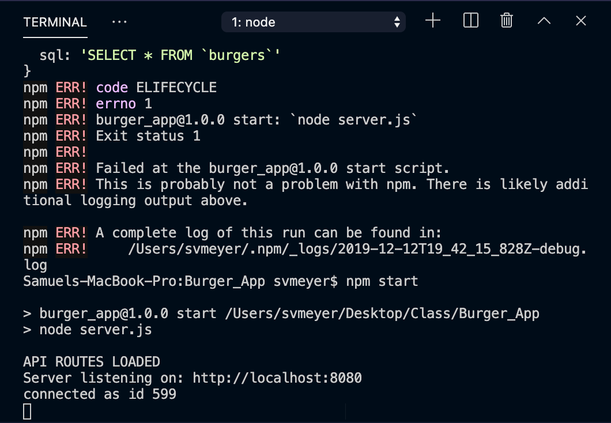
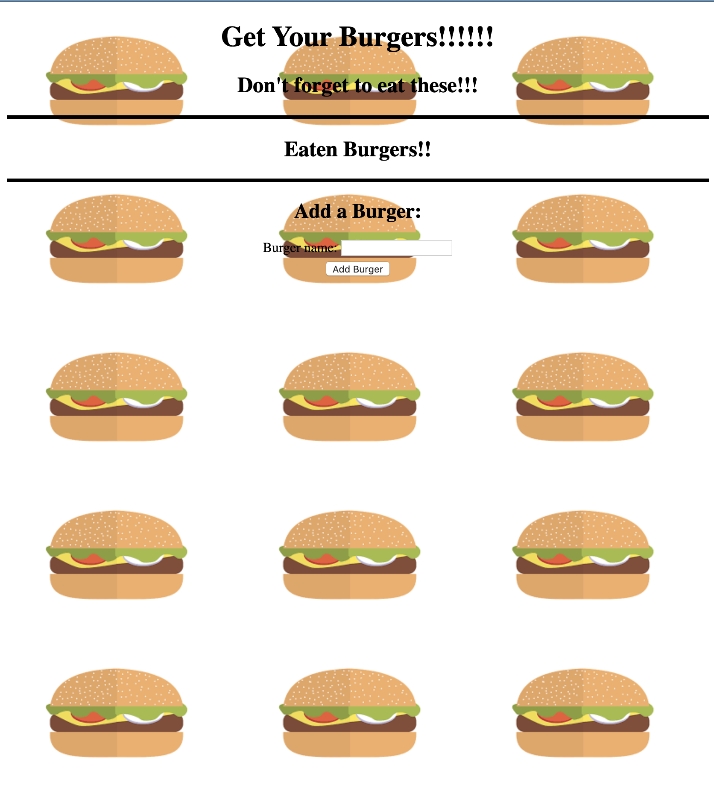
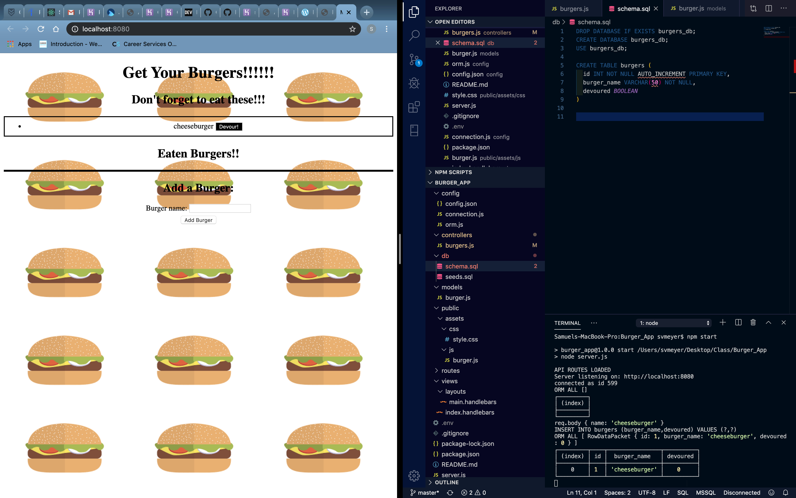
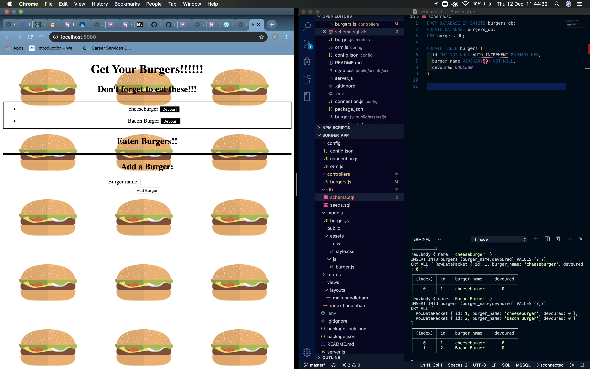
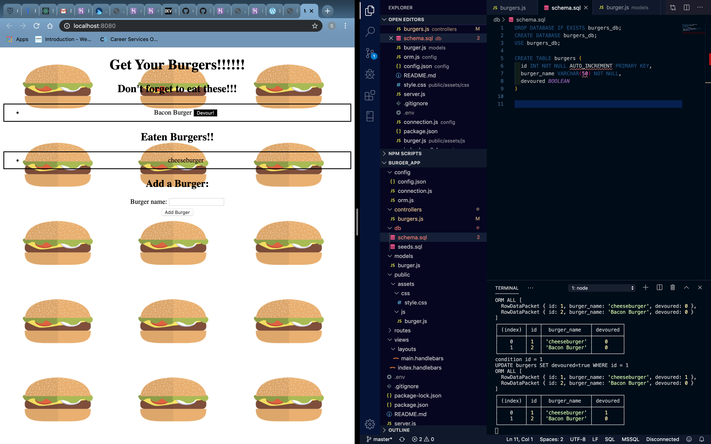

# Burger_App

## Overview
  This application allows you to keep track of burgers you still want to eat and burgers you have already eaten. You can add as many burgers you want to the database and "devour" them whenever you choose with the click of a button.

## Directions
  1. Open Application
  2. Type in a burger in form
  3. Click "add buger" button.
  4. Once done with the burger click "devour" button

## Images:
  Server is Running:
  
  
  App is running:
  

  Add a Burger:
  

  Add a second Burger:
  

  Devour a burger:
  

## Technologies Used
  - Express
  - Handlebars
  - Node.js
  - Javascript
  - MySql

  - Link to [GitHub] 